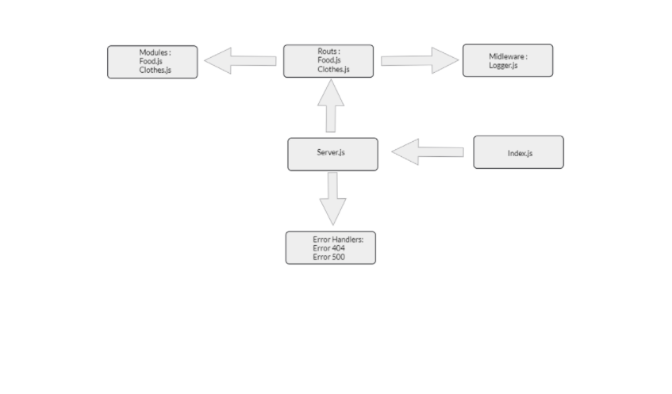

# basic-api-server

### Hassan Hamdan

 * Repository URL: https://github.com/HassanHamdanDev/basic-api-server

* Branch Name: dev

* Description : a web server get used to the general process of building basic-api-server

PR : 
- https://github.com/HassanHamdanDev/basic-api-server/pull/1 

HEROKU LINKS : https://hassan-api-servr.herokuapp.com/food  || clothes

- UML

